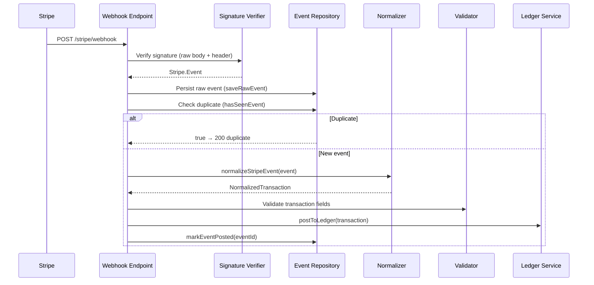

# Tekimax Stripe Webhook Ingestion

A secure, idempotent Stripe event pipeline built with **Node.js + Express + TypeScript**.

Receives webhook events from Stripe, verifies their authenticity, normalizes them
into canonical internal transactions, and posts double-entry journal entries to a
simulated ledger service.

---

## Architecture



## Project Structure

```
src/
├── index.ts                          Entry point — starts the server
├── app.ts                            Express app factory
├── config.ts                         Environment variable config
├── types/
│   ├── index.ts                      Re-exports
│   ├── transaction.ts                NormalizedTransaction interface
│   └── events.ts                     StoredEvent, IEventRepository
├── controllers/
│   └── webhook.controller.ts         Webhook HTTP handler
├── services/
│   ├── stripe.service.ts             Signature verification
│   ├── normalization.service.ts      Event → NormalizedTransaction
│   └── ledger.service.ts             Double-entry journal simulation
└── repositories/
    └── event.repository.ts           In-memory event store
```

## Setup

### Prerequisites

- Node.js 18+
- npm or yarn
- A Stripe account (test mode)

### Install Dependencies

```bash
npm install
```

### Environment Variables

Copy the example env file and fill in your values:

```bash
cp .env.example .env
```

| Variable               | Description                                       |
| ---------------------- | ------------------------------------------------- |
| `STRIPE_SECRET_KEY`    | Your Stripe secret key (`sk_test_...`)            |
| `STRIPE_WEBHOOK_SECRET`| Webhook endpoint signing secret (`whsec_...`)     |
| `PORT`                 | Server port (defaults to `3000`)                  |

### Run

```bash
# Development (ts-node)
npm run dev

# Or compile and run
npm run build
npm start
```

### Test with Stripe CLI

```bash
# Forward events to your local server
stripe listen --forward-to localhost:3000/stripe/webhook

# Trigger a test event
stripe trigger charge.succeeded
```

---

## Design Decisions

### Why `express.raw()` for the Webhook Route

Stripe signs the **exact bytes** it sends in the `Stripe-Signature` header. If
Express parses the body with `express.json()` first, re-serializing the parsed
object may produce different bytes (key ordering, whitespace). The signature
check would then fail. Using `express.raw({ type: "application/json" })` keeps
the body as a raw `Buffer`, which is what `stripe.webhooks.constructEvent()`
expects.

### How Idempotency Works

Stripe guarantees **at-least-once** delivery — the same event may arrive
multiple times (network retries, infrastructure replays). This pipeline uses
`event.id` as a natural idempotency key:

1. On arrival, check `hasSeenEvent(event.id)` against the store.
2. If already seen, return `200 { duplicate: true }` immediately.
3. If new, persist the raw event **before** any processing, ensuring a crash
   between receipt and processing doesn't lose the event.
4. After successful ledger posting, mark the event `POSTED`.
5. If processing fails, mark it `FAILED` with the error message for retry
   investigation.

### Storage Swap Path

The `IEventRepository` interface is the only contract the pipeline depends on.
The included `InMemoryEventRepository` can be replaced by a PostgreSQL-backed
class without changing the controller or services. See the SQL schema in
`src/types/events.ts`.

### Double-Entry Bookkeeping

The ledger service simulates journal entries following standard accounting
principles:

- **Inflows** (charges, invoice payments):
  `Debit Stripe Balance (Asset ↑) / Credit Revenue (Income ↑)`
- **Outflows** (refunds):
  `Debit Contra-Revenue (Expense ↑) / Credit Stripe Balance (Asset ↓)`

---

## Supported Event Types

| Stripe Event        | Internal Type      | Direction |
| ------------------- | ------------------ | --------- |
| `charge.succeeded`  | `charge`           | `INFLOW`  |
| `charge.refunded`   | `refund`           | `OUTFLOW` |
| `invoice.paid`      | `invoice_payment`  | `INFLOW`  |

Unsupported event types are acknowledged with `200` and marked `IGNORED`.
